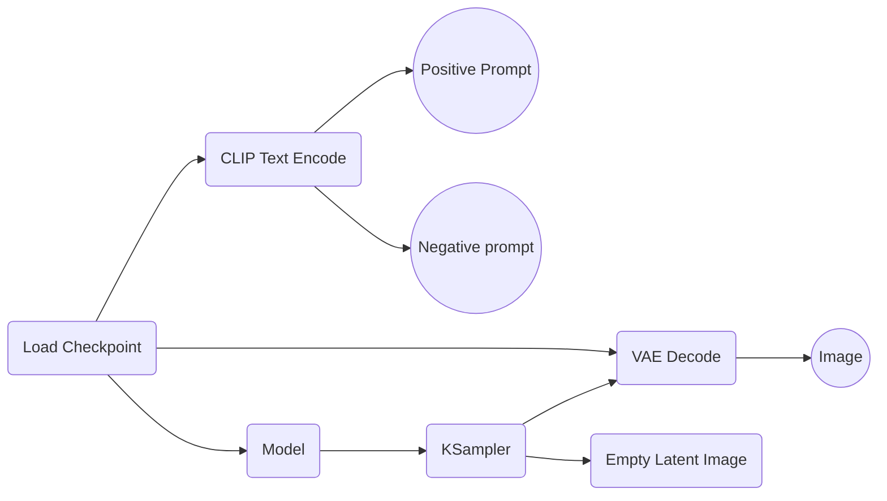

```mermaid
flowchart LR
A(Load Checkpoint) --> B(Model) & C(CLIP Text Encode) & D(VAE Decode)
C --> E((Positive Prompt)) & F((Negative prompt))
B --> G(KSampler)
G --> H("Empty Latent Image") & D
D --> I(("Image"))
click A callback "Il checkpoint va selezionato per far capire alla macchina come generare l'immagine"
click C "https://www.github.com" "CLIP model serve a, per saperne di più clicca su B"
click D href "https://www.github.com" "Questo è attualmente il mio sito preferito"

```